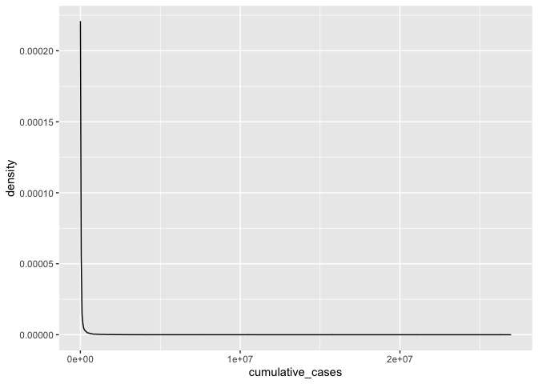

```r
library(tidyverse)
```

```
## ── Attaching packages ─────────────────────────────────────── tidyverse 1.3.0 ──
```

```
## ✓ ggplot2 3.3.3     ✓ purrr   0.3.4
## ✓ tibble  3.0.4     ✓ dplyr   1.0.2
## ✓ tidyr   1.1.2     ✓ stringr 1.4.0
## ✓ readr   1.4.0     ✓ forcats 0.5.0
```

```
## ── Conflicts ────────────────────────────────────────── tidyverse_conflicts() ──
## x dplyr::filter() masks stats::filter()
## x dplyr::lag()    masks stats::lag()
```

```r
library(janitor)
```

```
## 
## Attaching package: 'janitor'
```

```
## The following objects are masked from 'package:stats':
## 
##     chisq.test, fisher.test
```

```r
library(here)
```

```
## here() starts at /Users/srinidhi/Desktop/GitHub/BIS15W2021_Group_8
```

```r
library(naniar)
library(skimr)
```

```
## 
## Attaching package: 'skimr'
```

```
## The following object is masked from 'package:naniar':
## 
##     n_complete
```


```r
covid <- read.csv("Data/WHO-COVID-19-global-data.csv")
```


```r
covid<-janitor::clean_names(covid)
```


```r
head(covid)
```

```
##   date_reported country_code     country who_region new_cases cumulative_cases
## 1    2020-01-03           AF Afghanistan       EMRO         0                0
## 2    2020-01-04           AF Afghanistan       EMRO         0                0
## 3    2020-01-05           AF Afghanistan       EMRO         0                0
## 4    2020-01-06           AF Afghanistan       EMRO         0                0
## 5    2020-01-07           AF Afghanistan       EMRO         0                0
## 6    2020-01-08           AF Afghanistan       EMRO         0                0
##   new_deaths cumulative_deaths
## 1          0                 0
## 2          0                 0
## 3          0                 0
## 4          0                 0
## 5          0                 0
## 6          0                 0
```

```r
glimpse(covid)
```

```
## Rows: 96,222
## Columns: 8
## $ date_reported     <chr> "2020-01-03", "2020-01-04", "2020-01-05", "2020-01-…
## $ country_code      <chr> "AF", "AF", "AF", "AF", "AF", "AF", "AF", "AF", "AF…
## $ country           <chr> "Afghanistan", "Afghanistan", "Afghanistan", "Afgha…
## $ who_region        <chr> "EMRO", "EMRO", "EMRO", "EMRO", "EMRO", "EMRO", "EM…
## $ new_cases         <int> 0, 0, 0, 0, 0, 0, 0, 0, 0, 0, 0, 0, 0, 0, 0, 0, 0, …
## $ cumulative_cases  <int> 0, 0, 0, 0, 0, 0, 0, 0, 0, 0, 0, 0, 0, 0, 0, 0, 0, …
## $ new_deaths        <int> 0, 0, 0, 0, 0, 0, 0, 0, 0, 0, 0, 0, 0, 0, 0, 0, 0, …
## $ cumulative_deaths <int> 0, 0, 0, 0, 0, 0, 0, 0, 0, 0, 0, 0, 0, 0, 0, 0, 0, …
```

```r
skim(covid)
```


Table: Data summary

|                         |      |
|:------------------------|:-----|
|Name                     |covid |
|Number of rows           |96222 |
|Number of columns        |8     |
|_______________________  |      |
|Column type frequency:   |      |
|character                |4     |
|numeric                  |4     |
|________________________ |      |
|Group variables          |None  |


**Variable type: character**

|skim_variable | n_missing| complete_rate| min| max| empty| n_unique| whitespace|
|:-------------|---------:|-------------:|---:|---:|-----:|--------:|----------:|
|date_reported |         0|             1|  10|  10|     0|      406|          0|
|country_code  |       406|             1|   1|   2|     0|      236|        406|
|country       |         0|             1|   4|  56|     0|      237|          0|
|who_region    |         0|             1|   4|   5|     0|        7|          0|


**Variable type: numeric**

|skim_variable     | n_missing| complete_rate|      mean|        sd|     p0| p25| p50|      p75|     p100|hist  |
|:-----------------|---------:|-------------:|---------:|---------:|------:|---:|---:|--------:|--------:|:-----|
|new_cases         |         0|             1|   1111.92|   7525.43| -32952|   0|   3|   172.00|   402270|▇▁▁▁▁ |
|cumulative_cases  |         0|             1| 120688.43| 827691.39|      0|   5| 864| 16985.75| 26923756|▇▁▁▁▁ |
|new_deaths        |         0|             1|     24.39|    140.32|   -514|   0|   0|     3.00|     6409|▇▁▁▁▁ |
|cumulative_deaths |         0|             1|   3202.05|  17806.41|      0|   0|  14|   316.75|   464412|▇▁▁▁▁ |
#### NAs are represented by "NA" or "########"


```r
covid %>% 
  group_by(country) %>% 
  arrange(desc(cumulative_cases))
```

```
## # A tibble: 96,222 x 8
## # Groups:   country [237]
##    date_reported country_code country who_region new_cases cumulative_cases
##    <chr>         <chr>        <chr>   <chr>          <int>            <int>
##  1 2021-02-11    US           United… AMRO           90930         26923756
##  2 2021-02-10    US           United… AMRO           86449         26832826
##  3 2021-02-09    US           United… AMRO           91412         26746377
##  4 2021-02-08    US           United… AMRO          106988         26654965
##  5 2021-02-07    US           United… AMRO          129961         26547977
##  6 2021-02-06    US           United… AMRO          124866         26418016
##  7 2021-02-05    US           United… AMRO          120876         26293150
##  8 2021-02-04    US           United… AMRO          116762         26172274
##  9 2021-02-03    US           United… AMRO          125444         26055512
## 10 2021-02-02    US           United… AMRO          112129         25930068
## # … with 96,212 more rows, and 2 more variables: new_deaths <int>,
## #   cumulative_deaths <int>
```

```r
covid %>% 
  filter(date_reported=="2021-02-11") %>% 
  arrange(desc(cumulative_cases))
```

```
##     date_reported country_code
## 1      2021-02-11           US
## 2      2021-02-11           IN
## 3      2021-02-11           BR
## 4      2021-02-11           RU
## 5      2021-02-11           GB
## 6      2021-02-11           FR
## 7      2021-02-11           ES
## 8      2021-02-11           IT
## 9      2021-02-11           TR
## 10     2021-02-11           DE
## 11     2021-02-11           CO
## 12     2021-02-11           AR
## 13     2021-02-11           MX
## 14     2021-02-11           PL
## 15     2021-02-11           IR
## 16     2021-02-11           ZA
## 17     2021-02-11           UA
## 18     2021-02-11           PE
## 19     2021-02-11           ID
## 20     2021-02-11           CZ
## 21     2021-02-11           NL
## 22     2021-02-11           CA
## 23     2021-02-11           PT
## 24     2021-02-11           CL
## 25     2021-02-11           RO
## 26     2021-02-11           BE
## 27     2021-02-11           IL
## 28     2021-02-11           IQ
## 29     2021-02-11           SE
## 30     2021-02-11           PK
## 31     2021-02-11           PH
## 32     2021-02-11           BD
## 33     2021-02-11           CH
## 34     2021-02-11           MA
## 35     2021-02-11           AT
## 36     2021-02-11           RS
## 37     2021-02-11           JP
## 38     2021-02-11           HU
## 39     2021-02-11           SA
## 40     2021-02-11           JO
## 41     2021-02-11           AE
## 42     2021-02-11           PA
## 43     2021-02-11           LB
## 44     2021-02-11           NP
## 45     2021-02-11           SK
## 46     2021-02-11           GE
## 47     2021-02-11           BY
## 48     2021-02-11           EC
## 49     2021-02-11           MY
## 50     2021-02-11           KZ
## 51     2021-02-11           HR
## 52     2021-02-11           AZ
## 53     2021-02-11           BO
## 54     2021-02-11           BG
## 55     2021-02-11           DO
## 56     2021-02-11           TN
## 57     2021-02-11           IE
## 58     2021-02-11           DK
## 59     2021-02-11           CR
## 60     2021-02-11           LT
## 61     2021-02-11           PS
## 62     2021-02-11           SI
## 63     2021-02-11           KW
## 64     2021-02-11           EG
## 65     2021-02-11           AM
## 66     2021-02-11           GR
## 67     2021-02-11           MD
## 68     2021-02-11           GT
## 69     2021-02-11           HN
## 70     2021-02-11           QA
## 71     2021-02-11           ET
## 72     2021-02-11           NG
## 73     2021-02-11           MM
## 74     2021-02-11           PY
## 75     2021-02-11           OM
## 76     2021-02-11           VE
## 77     2021-02-11           LY
## 78     2021-02-11           BA
## 79     2021-02-11           DZ
## 80     2021-02-11           BH
## 81     2021-02-11           KE
## 82     2021-02-11           CN
## 83     2021-02-11           PR
## 84     2021-02-11           MK
## 85     2021-02-11           AL
## 86     2021-02-11           KG
## 87     2021-02-11           KR
## 88     2021-02-11           UZ
## 89     2021-02-11           LV
## 90     2021-02-11           GH
## 91     2021-02-11           LK
## 92     2021-02-11           ME
## 93     2021-02-11           ZM
## 94     2021-02-11           NO
## 95     2021-02-11           XK
## 96     2021-02-11           SG
## 97     2021-02-11           SV
## 98     2021-02-11           AF
## 99     2021-02-11           LU
## 100    2021-02-11           EE
## 101    2021-02-11           FI
## 102    2021-02-11           MZ
## 103    2021-02-11           UY
## 104    2021-02-11           UG
## 105    2021-02-11         <NA>
## 106    2021-02-11           CU
## 107    2021-02-11           ZW
## 108    2021-02-11           CY
## 109    2021-02-11           CM
## 110    2021-02-11           CI
## 111    2021-02-11           SD
## 112    2021-02-11           SN
## 113    2021-02-11           AU
## 114    2021-02-11           MW
## 115    2021-02-11           BW
## 116    2021-02-11           TH
## 117    2021-02-11           CD
## 118    2021-02-11           AO
## 119    2021-02-11           MG
## 120    2021-02-11           MT
## 121    2021-02-11           PF
## 122    2021-02-11           JM
## 123    2021-02-11           MV
## 124    2021-02-11           RW
## 125    2021-02-11           MR
## 126    2021-02-11           SZ
## 127    2021-02-11           GF
## 128    2021-02-11           GN
## 129    2021-02-11           SY
## 130    2021-02-11           CV
## 131    2021-02-11           TJ
## 132    2021-02-11           GA
## 133    2021-02-11           BZ
## 134    2021-02-11           HT
## 135    2021-02-11           YT
## 136    2021-02-11           BF
## 137    2021-02-11           RE
## 138    2021-02-11           AD
## 139    2021-02-11           LS
## 140    2021-02-11           GP
## 141    2021-02-11           SR
## 142    2021-02-11           CG
## 143    2021-02-11           BS
## 144    2021-02-11           ML
## 145    2021-02-11           GY
## 146    2021-02-11           TT
## 147    2021-02-11           GU
## 148    2021-02-11           AW
## 149    2021-02-11           MQ
## 150    2021-02-11           IS
## 151    2021-02-11           DJ
## 152    2021-02-11           GQ
## 153    2021-02-11           TG
## 154    2021-02-11           NI
## 155    2021-02-11           CF
## 156    2021-02-11           SS
## 157    2021-02-11           SO
## 158    2021-02-11           NE
## 159    2021-02-11           CW
## 160    2021-02-11           BJ
## 161    2021-02-11           GM
## 162    2021-02-11           GI
## 163    2021-02-11           SL
## 164    2021-02-11           TD
## 165    2021-02-11           SM
## 166    2021-02-11           KM
## 167    2021-02-11           JE
## 168    2021-02-11           GW
## 169    2021-02-11           LI
## 170    2021-02-11           VI
## 171    2021-02-11           ER
## 172    2021-02-11           MN
## 173    2021-02-11           LC
## 174    2021-02-11           YE
## 175    2021-02-11           VN
## 176    2021-02-11           NZ
## 177    2021-02-11           LR
## 178    2021-02-11           SX
## 179    2021-02-11           BB
## 180    2021-02-11           BI
## 181    2021-02-11           TC
## 182    2021-02-11           MC
## 183    2021-02-11           SC
## 184    2021-02-11           ST
## 185    2021-02-11           MF
## 186    2021-02-11           VC
## 187    2021-02-11           PG
## 188    2021-02-11           BT
## 189    2021-02-11           GG
## 190    2021-02-11             
## 191    2021-02-11           BM
## 192    2021-02-11           FO
## 193    2021-02-11           MU
## 194    2021-02-11           TZ
## 195    2021-02-11           KH
## 196    2021-02-11           IM
## 197    2021-02-11           BL
## 198    2021-02-11           KY
## 199    2021-02-11           XA
## 200    2021-02-11           AG
## 201    2021-02-11           BN
## 202    2021-02-11           VG
## 203    2021-02-11           GD
## 204    2021-02-11           MP
## 205    2021-02-11           DM
## 206    2021-02-11           TL
## 207    2021-02-11           FJ
## 208    2021-02-11           NC
## 209    2021-02-11           FK
## 210    2021-02-11           LA
## 211    2021-02-11           KN
## 212    2021-02-11           GL
## 213    2021-02-11           VA
## 214    2021-02-11           PM
## 215    2021-02-11           XB
## 216    2021-02-11           AI
## 217    2021-02-11           MS
## 218    2021-02-11           SB
## 219    2021-02-11           WF
## 220    2021-02-11           XC
## 221    2021-02-11           MH
## 222    2021-02-11           WS
## 223    2021-02-11           VU
## 224    2021-02-11           AS
## 225    2021-02-11           CK
## 226    2021-02-11           KP
## 227    2021-02-11           KI
## 228    2021-02-11           FM
## 229    2021-02-11           NR
## 230    2021-02-11           NU
## 231    2021-02-11           PW
## 232    2021-02-11           PN
## 233    2021-02-11           SH
## 234    2021-02-11           TK
## 235    2021-02-11           TO
## 236    2021-02-11           TM
## 237    2021-02-11           TV
##                                                      country who_region
## 1                                   United States of America       AMRO
## 2                                                      India      SEARO
## 3                                                     Brazil       AMRO
## 4                                         Russian Federation       EURO
## 5                                         The United Kingdom       EURO
## 6                                                     France       EURO
## 7                                                      Spain       EURO
## 8                                                      Italy       EURO
## 9                                                     Turkey       EURO
## 10                                                   Germany       EURO
## 11                                                  Colombia       AMRO
## 12                                                 Argentina       AMRO
## 13                                                    Mexico       AMRO
## 14                                                    Poland       EURO
## 15                                Iran (Islamic Republic of)       EMRO
## 16                                              South Africa       AFRO
## 17                                                   Ukraine       EURO
## 18                                                      Peru       AMRO
## 19                                                 Indonesia      SEARO
## 20                                                   Czechia       EURO
## 21                                               Netherlands       EURO
## 22                                                    Canada       AMRO
## 23                                                  Portugal       EURO
## 24                                                     Chile       AMRO
## 25                                                   Romania       EURO
## 26                                                   Belgium       EURO
## 27                                                    Israel       EURO
## 28                                                      Iraq       EMRO
## 29                                                    Sweden       EURO
## 30                                                  Pakistan       EMRO
## 31                                               Philippines       WPRO
## 32                                                Bangladesh      SEARO
## 33                                               Switzerland       EURO
## 34                                                   Morocco       EMRO
## 35                                                   Austria       EURO
## 36                                                    Serbia       EURO
## 37                                                     Japan       WPRO
## 38                                                   Hungary       EURO
## 39                                              Saudi Arabia       EMRO
## 40                                                    Jordan       EMRO
## 41                                      United Arab Emirates       EMRO
## 42                                                    Panama       AMRO
## 43                                                   Lebanon       EMRO
## 44                                                     Nepal      SEARO
## 45                                                  Slovakia       EURO
## 46                                                   Georgia       EURO
## 47                                                   Belarus       EURO
## 48                                                   Ecuador       AMRO
## 49                                                  Malaysia       WPRO
## 50                                                Kazakhstan       EURO
## 51                                                   Croatia       EURO
## 52                                                Azerbaijan       EURO
## 53                          Bolivia (Plurinational State of)       AMRO
## 54                                                  Bulgaria       EURO
## 55                                        Dominican Republic       AMRO
## 56                                                   Tunisia       EMRO
## 57                                                   Ireland       EURO
## 58                                                   Denmark       EURO
## 59                                                Costa Rica       AMRO
## 60                                                 Lithuania       EURO
## 61  occupied Palestinian territory, including east Jerusalem       EMRO
## 62                                                  Slovenia       EURO
## 63                                                    Kuwait       EMRO
## 64                                                     Egypt       EMRO
## 65                                                   Armenia       EURO
## 66                                                    Greece       EURO
## 67                                       Republic of Moldova       EURO
## 68                                                 Guatemala       AMRO
## 69                                                  Honduras       AMRO
## 70                                                     Qatar       EMRO
## 71                                                  Ethiopia       AFRO
## 72                                                   Nigeria       AFRO
## 73                                                   Myanmar      SEARO
## 74                                                  Paraguay       AMRO
## 75                                                      Oman       EMRO
## 76                        Venezuela (Bolivarian Republic of)       AMRO
## 77                                                     Libya       EMRO
## 78                                    Bosnia and Herzegovina       EURO
## 79                                                   Algeria       AFRO
## 80                                                   Bahrain       EMRO
## 81                                                     Kenya       AFRO
## 82                                                     China       WPRO
## 83                                               Puerto Rico       AMRO
## 84                                           North Macedonia       EURO
## 85                                                   Albania       EURO
## 86                                                Kyrgyzstan       EURO
## 87                                         Republic of Korea       WPRO
## 88                                                Uzbekistan       EURO
## 89                                                    Latvia       EURO
## 90                                                     Ghana       AFRO
## 91                                                 Sri Lanka      SEARO
## 92                                                Montenegro       EURO
## 93                                                    Zambia       AFRO
## 94                                                    Norway       EURO
## 95                                                 Kosovo[1]       EURO
## 96                                                 Singapore       WPRO
## 97                                               El Salvador       AMRO
## 98                                               Afghanistan       EMRO
## 99                                                Luxembourg       EURO
## 100                                                  Estonia       EURO
## 101                                                  Finland       EURO
## 102                                               Mozambique       AFRO
## 103                                                  Uruguay       AMRO
## 104                                                   Uganda       AFRO
## 105                                                  Namibia       AFRO
## 106                                                     Cuba       AMRO
## 107                                                 Zimbabwe       AFRO
## 108                                                   Cyprus       EURO
## 109                                                 Cameroon       AFRO
## 110                                            Côte d’Ivoire       AFRO
## 111                                                    Sudan       EMRO
## 112                                                  Senegal       AFRO
## 113                                                Australia       WPRO
## 114                                                   Malawi       AFRO
## 115                                                 Botswana       AFRO
## 116                                                 Thailand      SEARO
## 117                         Democratic Republic of the Congo       AFRO
## 118                                                   Angola       AFRO
## 119                                               Madagascar       AFRO
## 120                                                    Malta       EURO
## 121                                         French Polynesia       WPRO
## 122                                                  Jamaica       AMRO
## 123                                                 Maldives      SEARO
## 124                                                   Rwanda       AFRO
## 125                                               Mauritania       AFRO
## 126                                                 Eswatini       AFRO
## 127                                            French Guiana       AMRO
## 128                                                   Guinea       AFRO
## 129                                     Syrian Arab Republic       EMRO
## 130                                               Cabo Verde       AFRO
## 131                                               Tajikistan       EURO
## 132                                                    Gabon       AFRO
## 133                                                   Belize       AMRO
## 134                                                    Haiti       AMRO
## 135                                                  Mayotte       AFRO
## 136                                             Burkina Faso       AFRO
## 137                                                  Réunion       AFRO
## 138                                                  Andorra       EURO
## 139                                                  Lesotho       AFRO
## 140                                               Guadeloupe       AMRO
## 141                                                 Suriname       AMRO
## 142                                                    Congo       AFRO
## 143                                                  Bahamas       AMRO
## 144                                                     Mali       AFRO
## 145                                                   Guyana       AMRO
## 146                                      Trinidad and Tobago       AMRO
## 147                                                     Guam       WPRO
## 148                                                    Aruba       AMRO
## 149                                               Martinique       AMRO
## 150                                                  Iceland       EURO
## 151                                                 Djibouti       EMRO
## 152                                        Equatorial Guinea       AFRO
## 153                                                     Togo       AFRO
## 154                                                Nicaragua       AMRO
## 155                                 Central African Republic       AFRO
## 156                                              South Sudan       AFRO
## 157                                                  Somalia       EMRO
## 158                                                    Niger       AFRO
## 159                                                  Curaçao       AMRO
## 160                                                    Benin       AFRO
## 161                                                   Gambia       AFRO
## 162                                                Gibraltar       EURO
## 163                                             Sierra Leone       AFRO
## 164                                                     Chad       AFRO
## 165                                               San Marino       EURO
## 166                                                  Comoros       AFRO
## 167                                                   Jersey       EURO
## 168                                            Guinea-Bissau       AFRO
## 169                                            Liechtenstein       EURO
## 170                             United States Virgin Islands       AMRO
## 171                                                  Eritrea       AFRO
## 172                                                 Mongolia       WPRO
## 173                                              Saint Lucia       AMRO
## 174                                                    Yemen       EMRO
## 175                                                 Viet Nam       WPRO
## 176                                              New Zealand       WPRO
## 177                                                  Liberia       AFRO
## 178                                             Sint Maarten       AMRO
## 179                                                 Barbados       AMRO
## 180                                                  Burundi       AFRO
## 181                                 Turks and Caicos Islands       AMRO
## 182                                                   Monaco       EURO
## 183                                               Seychelles       AFRO
## 184                                    Sao Tome and Principe       AFRO
## 185                                             Saint Martin       AMRO
## 186                         Saint Vincent and the Grenadines       AMRO
## 187                                         Papua New Guinea       WPRO
## 188                                                   Bhutan      SEARO
## 189                                                 Guernsey       EURO
## 190                                                    Other      Other
## 191                                                  Bermuda       AMRO
## 192                                            Faroe Islands       EURO
## 193                                                Mauritius       AFRO
## 194                              United Republic of Tanzania       AFRO
## 195                                                 Cambodia       WPRO
## 196                                              Isle of Man       EURO
## 197                                         Saint Barthélemy       AMRO
## 198                                           Cayman Islands       AMRO
## 199                                                  Bonaire       AMRO
## 200                                      Antigua and Barbuda       AMRO
## 201                                        Brunei Darussalam       WPRO
## 202                                   British Virgin Islands       AMRO
## 203                                                  Grenada       AMRO
## 204           Northern Mariana Islands (Commonwealth of the)       WPRO
## 205                                                 Dominica       AMRO
## 206                                              Timor-Leste      SEARO
## 207                                                     Fiji       WPRO
## 208                                            New Caledonia       WPRO
## 209                              Falkland Islands (Malvinas)       AMRO
## 210                         Lao People's Democratic Republic       WPRO
## 211                                    Saint Kitts and Nevis       AMRO
## 212                                                Greenland       EURO
## 213                                                 Holy See       EURO
## 214                                Saint Pierre and Miquelon       AMRO
## 215                                           Sint Eustatius       AMRO
## 216                                                 Anguilla       AMRO
## 217                                               Montserrat       AMRO
## 218                                          Solomon Islands       WPRO
## 219                                        Wallis and Futuna       WPRO
## 220                                                     Saba       AMRO
## 221                                         Marshall Islands       WPRO
## 222                                                    Samoa       WPRO
## 223                                                  Vanuatu       WPRO
## 224                                           American Samoa       WPRO
## 225                                             Cook Islands       WPRO
## 226                    Democratic People's Republic of Korea      SEARO
## 227                                                 Kiribati       WPRO
## 228                         Micronesia (Federated States of)       WPRO
## 229                                                    Nauru       WPRO
## 230                                                     Niue       WPRO
## 231                                                    Palau       WPRO
## 232                                         Pitcairn Islands       WPRO
## 233                                             Saint Helena       AFRO
## 234                                                  Tokelau       WPRO
## 235                                                    Tonga       WPRO
## 236                                             Turkmenistan       EURO
## 237                                                   Tuvalu       WPRO
##     new_cases cumulative_cases new_deaths cumulative_deaths
## 1       90930         26923756       2802            464412
## 2       12923         10871294        108            155360
## 3       51486          9599565       1350            233520
## 4       15038          4027748        553             78687
## 5       13013          3985165       1001            114851
## 6       24631          3328987        295             80032
## 7        8298          3023601         86             63704
## 8       12947          2668266        336             92338
## 9        8642          2556837         95             27093
## 10      10237          2310233        666             63635
## 11       5442          2166904        217             56507
## 12       7794          1993295        158             49556
## 13      10738          1946751       1701            168432
## 14       7013          1570658        456             40177
## 15       7585          1488981         61             58686
## 16       3159          1482412        276             47145
## 17       5039          1258094        124             24058
## 18       5557          1196778        159             42626
## 19       8776          1183555        191             32167
## 20       9537          1064952        130             17772
## 21       3226          1012908         78             14589
## 22       2677           810797         74             20909
## 23       4387           774889        161             14718
## 24       2387           760576         21             19105
## 25       3048           752482         79             19135
## 26          0           730951          0             21512
## 27       6075           705092         39              5238
## 28       2282           634539          6             13140
## 29       4070           600244          3             12326
## 30       1072           557591         62             12128
## 31       1333           541560        105             11401
## 32        388           539153         10              8239
## 33       1598           535511         17              8931
## 34        564           476689         12              8436
## 35       1433           424005         29              8013
## 36       2088           413943         14              4168
## 37       1826           410012        121              6678
## 38       1862           381875         97             13444
## 39        369           371356          5              6415
## 40       1855           340177         16              4411
## 41       3539           336142          9               956
## 42        822           328476         25              5531
## 43       3157           328016         66              3803
## 44        134           272349          0              2047
## 45       3179           268986        120              5502
## 46        557           264158         10              3321
## 47       1799           261859         10              1811
## 48          0           259783          0             15086
## 49       3288           251604         14               923
## 50          0           247533          0              3185
## 51        376           236709         25              5263
## 52        147           231509          4              3167
## 53       1544           230731         65             10929
## 54        913           226974         45              9527
## 55        934           225472         19              2883
## 56       1086           219650         46              7378
## 57        999           205939         42              3794
## 58        470           202887         11              2255
## 59        417           197852          6              2698
## 60       1067           189058         25              3013
## 61        761           185760         12              2100
## 62       1431           175795          1              3895
## 63        987           173983          5               980
## 64        610           171390         53              9804
## 65        180           168676          5              3135
## 66       1482           167549         17              6034
## 67        890           166553         16              3589
## 68        753           164746         34              5989
## 69        871           156606         47              3789
## 70        451           155453          0               253
## 71        683           144249          9              2167
## 72       1131           142578          8              1702
## 73         39           141487          1              3181
## 74        874           139819         16              2862
## 75        190           136377          1              1537
## 76        500           131096          7              1247
## 77        467           126028          7              1989
## 78        253           124696         19              4853
## 79        223           109782          2              2926
## 80        797           109604          4               391
## 81        173           102221          2              1791
## 82         21           101429          1              4834
## 83         92            96494          4              1897
## 84        389            95736          4              2959
## 85       1143            88671         15              1503
## 86         75            85328          1              1437
## 87        504            82434         10              1496
## 88         66            79303          1               622
## 89        990            73859         32              1395
## 90          0            73003          0               482
## 91        963            72174          5               375
## 92          0            66853          0               852
## 93        963            65573         20               901
## 94        222            65338          9               592
## 95        307            63046          4              1522
## 96         15            59747          0                29
## 97          0            56653          8              1709
## 98         18            55420          1              2419
## 99        225            52247          2               602
## 100       675            50280          3               480
## 101       400            48807          3               706
## 102       951            46736          6               486
## 103       503            46153          9               506
## 104        28            39911          1               328
## 105        41            35242          1               378
## 106       858            34922          5               249
## 107        79            34864         11              1364
## 108       113            32072          3               217
## 109         0            31394          0               474
## 110       166            30240          4               169
## 111        32            29933          6              1849
## 112       276            29521         12               712
## 113        11            28871          0               909
## 114       328            28050         17               900
## 115         0            24435          0               179
## 116       201            24104          0                80
## 117       119            23889          2               685
## 118        47            20210          9               487
## 119         0            19360          0               285
## 120       167            19182          2               286
## 121        22            18244          0               135
## 122       207            17908          3               362
## 123       100            17201          0                56
## 124       130            16941          3               229
## 125         0            16777          0               425
## 126        53            16341          6               616
## 127         0            16296          0                79
## 128        27            14791          0                84
## 129        57            14668          4               965
## 130        64            14543          1               138
## 131         0            13714          0                91
## 132       335            12171          0                71
## 133         9            12079          3               310
## 134        22            11991          0               246
## 135       336            11783          1                69
## 136        59            11426          0               134
## 137       420            10907          0                47
## 138        40            10352          0               106
## 139        86             9804          3               210
## 140         0             9302          0               159
## 141        20             8710          1               163
## 142         0             8354          0               122
## 143         0             8289          0               176
## 144        11             8203          0               339
## 145        18             8041          0               181
## 146         1             7617          1               136
## 147        10             7476          0               130
## 148        48             7286          2                66
## 149         0             6521          0                45
## 150         1             6026          0                29
## 151         3             5962          0                63
## 152         0             5614          0                87
## 153        30             5606          0                80
## 154         0             5064          0               171
## 155         7             4996          0                63
## 156       351             4960          6                71
## 157        73             4935          5               139
## 158         0             4643          0               167
## 159         7             4620          1                22
## 160         0             4560          0                56
## 161         0             4302          0               135
## 162         3             4190          0                83
## 163        14             3803          0                79
## 164        29             3568          1               126
## 165        26             3213          0                71
## 166        30             3209          2               120
## 167        10             3187          0                67
## 168        16             2826          0                46
## 169         4             2607          1                47
## 170        12             2485          0                24
## 171        17             2418          0                 7
## 172        54             2174          0                 2
## 173       110             2137          3                22
## 174         2             2137          1               617
## 175        39             2109          0                35
## 176         1             1968          0                25
## 177         0             1956          0                84
## 178        14             1952          0                27
## 179        82             1814          2                20
## 180        20             1771          0                 3
## 181        43             1738          0                 9
## 182        22             1717          0                20
## 183       120             1695          0                 7
## 184        45             1430          0                18
## 185         0             1377          0                12
## 186        16             1340          2                 6
## 187        14              914          0                 9
## 188         0              861          0                 1
## 189        11              752          0                13
## 190         0              745          0                13
## 191         0              694          0                12
## 192         0              657          0                 1
## 193        10              594          0                10
## 194         0              509          0                21
## 195         0              478          0                 0
## 196         1              436          0                25
## 197         0              425          0                 0
## 198         0              408          0                 2
## 199         0              368          1                 4
## 200        34              350          1                 9
## 201         1              183          0                 3
## 202        10              151          0                 1
## 203         0              148          0                 1
## 204         0              133          0                 2
## 205         0              121          0                 0
## 206        14              100          0                 0
## 207         0               56          0                 2
## 208         0               50          0                 0
## 209         0               49          0                 0
## 210         0               45          0                 0
## 211         0               40          0                 0
## 212         0               30          0                 0
## 213         0               26          0                 0
## 214         0               24          0                 0
## 215         0               20          0                 0
## 216         0               18          0                 0
## 217         0               18          0                 1
## 218         0               18          0                 0
## 219         0                9          0                 0
## 220         0                6          0                 0
## 221         0                4          0                 0
## 222         0                3          0                 0
## 223         0                1          0                 0
## 224         0                0          0                 0
## 225         0                0          0                 0
## 226         0                0          0                 0
## 227         0                0          0                 0
## 228         0                0          0                 0
## 229         0                0          0                 0
## 230         0                0          0                 0
## 231         0                0          0                 0
## 232         0                0          0                 0
## 233         0                0          0                 0
## 234         0                0          0                 0
## 235         0                0          0                 0
## 236         0                0          0                 0
## 237         0                0          0                 0
```
#### We're going vaccine data for the top 5 countries with the most COVID-19 cases to date.  USA, India, Brazil, Russian Federation, UK.


```r
covid %>% 
  ggplot(aes(x=cumulative_cases))+geom_density()
```

<!-- -->
##### We have to figure out how to make this not a logarithmic scale.

##### We can use faceting to compare cases.

##### Use pivot wide to analyze a single country over time.

##### Create comparative plots

##### Find data on populations + governments of these countries to compare the covid data. (Along with vaccine data)

##### Maybe make a website that showcases our analysis of this data.
