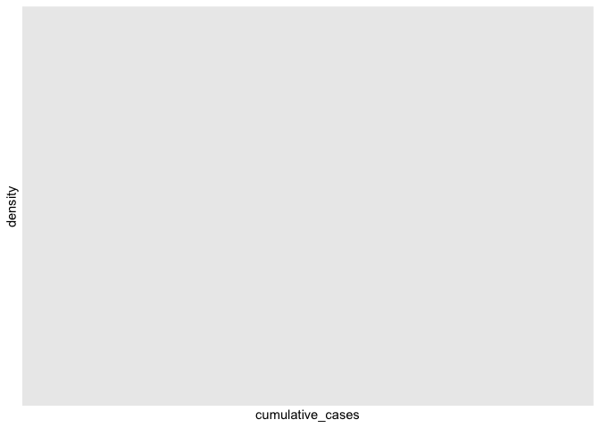

```r
library(tidyverse)
```

```
## ── Attaching packages ─────────────────────────────────────── tidyverse 1.3.0 ──
```

```
## ✓ ggplot2 3.3.3     ✓ purrr   0.3.4
## ✓ tibble  3.1.0     ✓ dplyr   1.0.4
## ✓ tidyr   1.1.2     ✓ stringr 1.4.0
## ✓ readr   1.4.0     ✓ forcats 0.5.1
```

```
## ── Conflicts ────────────────────────────────────────── tidyverse_conflicts() ──
## x dplyr::filter() masks stats::filter()
## x dplyr::lag()    masks stats::lag()
```

```r
library(janitor)
```

```
## 
## Attaching package: 'janitor'
```

```
## The following objects are masked from 'package:stats':
## 
##     chisq.test, fisher.test
```

```r
library(here)
```

```
## here() starts at /Users/srinidhi/Desktop/GitHub/BIS15W2021_Group_8
```

```r
library(naniar)
library(skimr)
```

```
## 
## Attaching package: 'skimr'
```

```
## The following object is masked from 'package:naniar':
## 
##     n_complete
```


```r
covid <- read.csv("Data/WHO-COVID-19-global-data.csv")
```


```r
covid<-janitor::clean_names(covid)
```


```r
head(covid)
```

```
##   date_reported country_code     country who_region new_cases cumulative_cases
## 1      1/3/2020           AF Afghanistan       EMRO         0                0
## 2      1/4/2020           AF Afghanistan       EMRO         0                0
## 3      1/5/2020           AF Afghanistan       EMRO         0                0
## 4      1/6/2020           AF Afghanistan       EMRO         0                0
## 5      1/7/2020           AF Afghanistan       EMRO         0                0
## 6      1/8/2020           AF Afghanistan       EMRO         0                0
##   new_deaths cumulative_deaths
## 1          0                 0
## 2          0                 0
## 3          0                 0
## 4          0                 0
## 5          0                 0
## 6          0                 0
```

```r
glimpse(covid)
```

```
## Rows: 96,222
## Columns: 8
## $ date_reported     <chr> "1/3/2020", "1/4/2020", "1/5/2020", "1/6/2020", "1/7…
## $ country_code      <chr> "AF", "AF", "AF", "AF", "AF", "AF", "AF", "AF", "AF"…
## $ country           <chr> "Afghanistan", "Afghanistan", "Afghanistan", "Afghan…
## $ who_region        <chr> "EMRO", "EMRO", "EMRO", "EMRO", "EMRO", "EMRO", "EMR…
## $ new_cases         <int> 0, 0, 0, 0, 0, 0, 0, 0, 0, 0, 0, 0, 0, 0, 0, 0, 0, 0…
## $ cumulative_cases  <int> 0, 0, 0, 0, 0, 0, 0, 0, 0, 0, 0, 0, 0, 0, 0, 0, 0, 0…
## $ new_deaths        <int> 0, 0, 0, 0, 0, 0, 0, 0, 0, 0, 0, 0, 0, 0, 0, 0, 0, 0…
## $ cumulative_deaths <int> 0, 0, 0, 0, 0, 0, 0, 0, 0, 0, 0, 0, 0, 0, 0, 0, 0, 0…
```

```r
skim(covid)
```


Table: Data summary

|                         |      |
|:------------------------|:-----|
|Name                     |covid |
|Number of rows           |96222 |
|Number of columns        |8     |
|_______________________  |      |
|Column type frequency:   |      |
|character                |4     |
|numeric                  |4     |
|________________________ |      |
|Group variables          |None  |


**Variable type: character**

|skim_variable | n_missing| complete_rate| min| max| empty| n_unique| whitespace|
|:-------------|---------:|-------------:|---:|---:|-----:|--------:|----------:|
|date_reported |         0|             1|   8|  10|     0|      406|          0|
|country_code  |       406|             1|   1|   2|     0|      236|        406|
|country       |         0|             1|   4|  56|     0|      237|          0|
|who_region    |         0|             1|   4|   5|     0|        7|          0|


**Variable type: numeric**

|skim_variable     | n_missing| complete_rate|      mean|        sd|     p0| p25| p50|      p75|     p100|hist  |
|:-----------------|---------:|-------------:|---------:|---------:|------:|---:|---:|--------:|--------:|:-----|
|new_cases         |         0|             1|   1111.92|   7525.43| -32952|   0|   3|   172.00|   402270|▇▁▁▁▁ |
|cumulative_cases  |         0|             1| 120688.43| 827691.39|      0|   5| 864| 16985.75| 26923756|▇▁▁▁▁ |
|new_deaths        |         0|             1|     24.39|    140.32|   -514|   0|   0|     3.00|     6409|▇▁▁▁▁ |
|cumulative_deaths |         0|             1|   3202.05|  17806.41|      0|   0|  14|   316.75|   464412|▇▁▁▁▁ |
#### NAs are represented by "NA" or "########"


```r
covid %>% 
  group_by(country) %>% 
  arrange(desc(cumulative_cases))
```

```
## # A tibble: 96,222 x 8
## # Groups:   country [237]
##    date_reported country_code country      who_region new_cases cumulative_cases
##    <chr>         <chr>        <chr>        <chr>          <int>            <int>
##  1 2/11/2021     US           United Stat… AMRO           90930         26923756
##  2 2/10/2021     US           United Stat… AMRO           86449         26832826
##  3 2/9/2021      US           United Stat… AMRO           91412         26746377
##  4 2/8/2021      US           United Stat… AMRO          106988         26654965
##  5 2/7/2021      US           United Stat… AMRO          129961         26547977
##  6 2/6/2021      US           United Stat… AMRO          124866         26418016
##  7 2/5/2021      US           United Stat… AMRO          120876         26293150
##  8 2/4/2021      US           United Stat… AMRO          116762         26172274
##  9 2/3/2021      US           United Stat… AMRO          125444         26055512
## 10 2/2/2021      US           United Stat… AMRO          112129         25930068
## # … with 96,212 more rows, and 2 more variables: new_deaths <int>,
## #   cumulative_deaths <int>
```

```r
covid %>% 
  filter(date_reported== "2021-02-11") %>% 
  arrange(desc(cumulative_cases))
```

```
## [1] date_reported     country_code      country           who_region       
## [5] new_cases         cumulative_cases  new_deaths        cumulative_deaths
## <0 rows> (or 0-length row.names)
```
#### We're going vaccine data for the top 5 countries with the most COVID-19 cases to date.  USA, India, Brazil, Russian Federation, UK.


```r
covid %>%
  filter(date_reported=="2021-02-11")%>%
  ggplot(aes(x=cumulative_cases))+
           scale_y_log10()+
           geom_density()
```

<!-- -->

##### We have to figure out how to make this not a logarithmic scale.

##### We can use faceting to compare cases.

##### Use pivot wide to analyze a single country over time.

```r
covid$date_reported <- as.Date(covid$date_reported)
covid$cumulative_cases <- as.numeric(as.character(covid$cumulative_cases))
```


```r
covid%>%
  filter(country_code == "US")%>%
  ggplot(aes(x = date_reported, y = cumulative_cases))+
  geom_line(aes(group = 1))+
  scale_x_date(date_labels = "%Y-%m-%d")+
  scale_x_date(date_breaks = "1 month")+
  scale_y_continuous(breaks = seq(0, 30000000, by = 2500000), limits=c(0, 30000000))+
  theme(axis.text.x=element_text(angle=45, hjust=1)) 
```

```
## Scale for 'x' is already present. Adding another scale for 'x', which will
## replace the existing scale.
```

```
## Warning: Removed 241 row(s) containing missing values (geom_path).
```

<!-- -->

##### Create comparative plots

```r
covid%>%
  group_by(country)%>%
  filter(country_code == "US"| country_code == "IN"| country_code == "BR"| country_code == "RU"| country_code == "GB")%>%
  ggplot(aes(x = date_reported, y = cumulative_cases, group = country, color = country))+
  geom_line()+
  scale_x_date(date_labels = "%Y-%m-%d")+
  scale_x_date(date_breaks = "1 month")+
  scale_y_continuous(breaks = seq(0, 30000000, by = 2500000), limits=c(0, 30000000))+
  theme(axis.text.x=element_text(angle=45, hjust=1)) 
```

```
## Scale for 'x' is already present. Adding another scale for 'x', which will
## replace the existing scale.
```

```
## Warning: Removed 1205 row(s) containing missing values (geom_path).
```

<!-- -->

##### Find data on populations + governments of these countries to compare the covid data. (Along with vaccine data)


##### Maybe make a website that showcases our analysis of this data.
